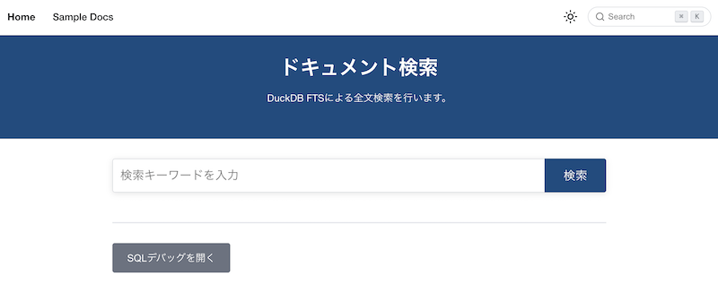

# Docusaurus Search with DuckDB Example

DuckDB WASMを使用してブラウザ内で高速な全文検索を実現するDocusaurusプラグインの実装例です。

<picture>
  <source media="(prefers-color-scheme: dark)" srcset="screenshot-dark.png" />
  <source media="(prefers-color-scheme: light)" srcset="screenshot-light.png" />
  
</picture>

よろしければ、下記ブログ記事もご覧ください。

* [Docusaurus v3 の全文検索を DuckDB Wasm \+ FTS 拡張で実装した \- ROUTE06 Tech Blog](https://tech.route06.co.jp/entry/2025/06/04/170000)

> [!NOTE]
> 本件実装前に作成した PoC 版のコードが [poc/](./poc/) にあります。全文検索の他に、「日本語全文検索（わかち書き版）」と「ベクトル検索」もあります。

## 特徴

- **ブラウザ内検索**: DuckDB WASMを使用してサーバー不要の全文検索
- **高速検索**: BM25スコアリングによる関連度ベースの検索結果
- **SQLデバッグ**: 開発者向けのSQL実行デバッグ機能
- **リアルタイム**: ページ遷移なしでの検索結果表示

## 技術スタック

- [Docusaurus 3.4.0](https://docusaurus.io/) - 静的サイトジェネレータ
- [DuckDB WASM](https://duckdb.org/docs/api/wasm/overview.html) - ブラウザ内SQLデータベース
- React 18 + TypeScript - UIフレームワーク
- FTS (Full-Text Search) - 全文検索機能

## 動作方法

### 前提条件

- Node.js 22.16.0

### セットアップ

依存関係のインストール：

```bash
yarn
```

### 動作方法

開発サーバー起動：

```bash
yarn start
```

プロダクション用動作確認：

```bash
# プロダクションビルド
yarn build

# ビルド済みサイトをローカルで確認
yarn serve
```

## アーキテクチャ

### データフロー

1. **ドキュメント収集**: `collect-docs.js`が`docs/`と`blog/`のマークダウンファイルを収集
2. **データ変換**: マークダウンをパースしてプレーンテキストに変換
3. **JSON出力**: `static/docs.json`として構造化データを生成
4. **ブラウザロード**: DuckDB WASMが`docs.json`をロードしてFTSインデックスを作成
5. **検索実行**: BM25アルゴリズムによる関連度スコアベースの検索

### プラグイン構成

```
plugins/docusaurus-search-duckdb/
├── index.js                 # メインプラグインエントリ
├── scripts/
│   └── collect-docs.js      # ドキュメント収集スクリプト
└── src/
    ├── components/          # UIコンポーネント
    ├── theme/              # テーマコンポーネント
    ├── utils/              # ユーティリティ関数
    └── types/              # TypeScript型定義
```

## カスタマイズ

### プラグイン設定

`docusaurus.config.js`で設定をカスタマイズできます：

```javascript
plugins: [
  [
    "./plugins/docusaurus-search-duckdb",
    {
      routeBasePath: "/search",     // 検索ページのパス
      docsJsonPath: "docs.json",    // ドキュメントJSONファイルのパス
      enableDebugMode: true,        // SQLデバッグ機能の有効/無効
    },
  ],
],
```

### 対象ディレクトリの変更

環境変数`TARGET_DIRS`で収集対象ディレクトリを指定：

```bash
TARGET_DIRS="docs,blog,custom" yarn start
```

## ライセンス

Apache-2.0
