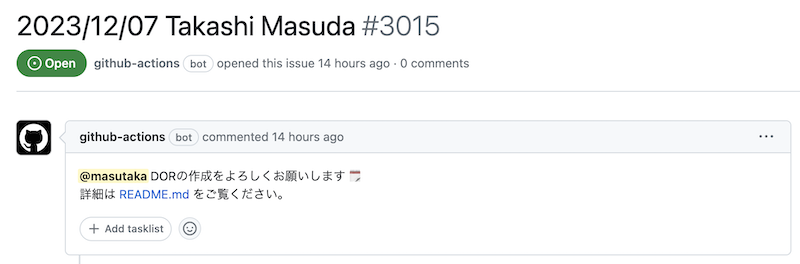

こんにちは。ROUTE06 データエンジニアの id:masutaka26:detail です。8/16 に入社したので、入社から 3 ヶ月経ち、会社にも慣れてきました。

初投稿である今回の記事では、ROUTE06 に入社して素直に変だと思った、会社の取り組みや習慣をまだフレッシュな気持ちが残っているうちに紹介します。

## 1. 入社 1on1 マラソン

早速出て参りました。全く聞き慣れないであろう「入社 1on1 マラソン」です。(\*^^\*)

ROUTE06 に入社したら、全ての正社員と 1on1 する必要があります。私は入社前に聞き流してしまったようで、入社後聞いた時は「これから 50 人と 1on1 するなんて正気ですか？」と思いました。

私は 1 回 30 分を毎日 2~3 セッティングして、8/21 ~ 9/25 で完走しました。期間は自由で、数ヶ月かける人もいるそうです。

初見の方と話すのは苦手且つ、毎日大変ではありましたが、効果は実感しました。

* ROUTE06 が出来た経緯を、複数の視点から知ることができた
* 社員どうしの繋がりを知ることができた
* 知り合いとの意外な繋がりを発見できた
* 同じ趣味の話などで話が盛り上がった

ROUTE06 はフルリモートワークの会社なので、オフィスで誰かに会う機会はほぼありません。全く顔を合わせたことがない人と、仕事の関係性をイチから作るのはなかなか大変です。完走してみて、会社として強制的な機会を与えることはありだと思いました。もちろん人数によりますけどね。

入社後の TODO に組み込まれているので、1 日が入社 1on1 で終わっても問題ないですし、相手も入社 1on1 に慣れています。ガイドラインもあります。その点はやりやすかったです。

聞くところによると、正社員数 20 人くらいから始まったそうです。積み重ねているから続けられているのであって、例えば同じ規模の会社がこれから始めるのは難しいだろうなと思いました。

代表の遠藤曰く「少なくとも 100 人になるまでは絶対に止めない。何ヶ月かかっても良い」とのこと。力強いですね。

## 2. 社内の情報を GitHub に集約している

こちらは各所で話されているので、すでにご存知かもしれません。

[全社ワークスペースに「GitHub」を選んだ理由と利用状況について｜ ROUTE06](https://note.route06.co.jp/n/n5b21649308cf)

とは言え、いわゆる esa や Qiita Team のようなドキュメント共有ツールを使わずに、ビジネス職含めた全社員が GitHub を使うと聞いた時は「本当に大丈夫？」と思いました。私は以前の職場に GitHub を導入したことがあるので、個人的にはとても歓迎なのですがね。

入社してみて、本当にそうでした。

* 会社全体に関係する情報は GitHub pages に蓄積する
* プロダクトごとの Stock 情報[^1]は GitHub のリポジトリに markdown ファイルを commit する
* 議事録やちょっとしたメモのような Flow 情報は Discussions や Issue を使う
* 採用や稟議用のリポジトリもあるらしい

[^1]: ずっと参照されメンテナンスし続ける必要のある情報

Slack もありますが、コミュニケーションツールとして使われているだけです。あとから参照することは少なく、参照する場合は Issue や Discussion にまとめられます。

GitHub を初めて使う方も多いため、研修用の動画があったり、必要に応じてエンジニアがサポートしています。

正直言って、GitHub だとやりづらいと感じることはありますが、制約があるからこそ、メリットを研ぎ澄ませられると思いました。まだまだ GitHub を使い倒せるはず。

### 3. 全社員が日報を書く必要がある

社内では日報は「DOR (Daily Operations Report)」と呼ばれており、毎朝とあるリポジトリで社員数分の Issue が作られ、そのうち 1 つが自分にアサインされます。

DOR が始まったのはつい最近で、2023/10/02 からです。それまでは書きたい人が書いていましたが、強制化された形です。私は書いていた人ですが、強制化されると聞いて、少しドキドキしました。

社員は退勤前に Issue のコメントとして DOR を記載し、当該 Issue をクローズします。書いていない場合は、担当マネージャーから確認があります。

一応テンプレートはありますが、必須項目以外は自由に変更することが出来ます。私は「ひとこと」に結構カジュアルなことを書くことがあり、コメントで盛り上がることもあります。

人によっては日報を書くのが苦手だったり、職種によっては大変なことはあるようで、苦労されているケースはあるようです。

DOR を書くための知見や意見も GitHub Discussion 上で共有されています。その中でツールが紹介されたり、新たに作られたりしました。会社としても、このような Hack の文化を奨励しています。

* DOR を書くための補助ツール
    * [github-nippou](https://github.com/masutaka/github-nippou)
    * [github-nippou-web](https://github.com/MH4GF/github-nippou-web)
* DOR を読むための補助ツール
    * [DOR Reader](https://github.com/toyamarinyon/coral)

## まとめ

「ここが変だよ ROUTE06」と感じたことを書きました。これ以上時間が経つと普通に感じてしまうと思うので、このタイミングで投稿できてよかったです。

なんとなく続いているのではなく、経営層の強い意志により戦略的に続けられており、毎月の全体会等でも説明があったりします。

他にも「絶対にフルリモートワークを止めない」「全社員 MacBook」などありますが、今回は割愛しました。

ここまで読むと、トップダウンの力が強い会社と感じるかもしれませんが、ボトムアップの力も強いです。個人的にはバランスが取れていると感じています。

これから ROUTE06 への入社を検討する方々をはじめ、どなたかへの一助となれば幸いです。
