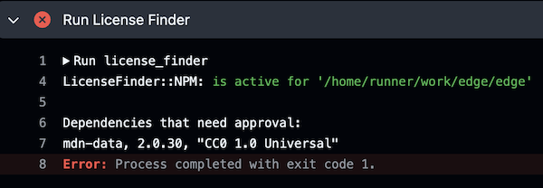

こんにちは。ソフトウェアエンジニアの id:masutaka26:detail です。

最近社内でいくつかのプロダクトの OSS 化が始まっています。OSS 化にあたり、利用パッケージとのソフトウェアライセンス（以下ライセンス）の競合はリスクになり得ます。

今回は License Finder というツールを導入することで、そのリスクを軽減し、継続的に監視し始めたお話を紹介します。

## License Finder の紹介

License Finder は Pivotal（現 VMWare）が開発した、Ruby 製のライセンスチェック用 CLI ツールです。

https://github.com/pivotal/LicenseFinder

パッケージマネージャと連携して依存関係を検索し、各パッケージのライセンスを特定します。bundler, npm, pnpm などに対応しています。

特定した各パッケージのライセンスはユーザが承認したライセンスリストと比較され、結果を出力します。CI に組み込むことも可能です。

### インストール方法

Ruby 2.6.0 以上でインストールします。

```console
$ gem install license_finder
```

### 実行方法

`bundle install` や `npm install` 等で、依存パッケージをインストールします。

あとは License Finder を実行するだけです。

💡 パッケージマネージャは自動的に選択されます。手動で設定したい場合は、設定ファイル `config/license_finder.yml` に記載すると良いでしょう。詳細は [README.md の Saving Configuration](https://github.com/pivotal/LicenseFinder#saving-configuration) をどうぞ。

実行すると、全ての依存パッケージがライセンス名とともに出力されます。全ての依存パッケージが未承認の状態です。

```console
$ license_finder
LicenseFinder::Bundler: is active for '/Users/masutaka/work'

Dependencies that need approval:
actioncable, 7.2.1, MIT
actionmailbox, 7.2.1, MIT
(snip)
```

### 依存関係の承認

未承認の依存パッケージをゼロにすることがゴールです。

基本はライセンス単位で承認し、必要に応じてパッケージを承認または無視すると良いでしょう。以下は例です。

```console
# MIT と Apache-2.0 ライセンスを許可する
$ license_finder permitted_licenses add "MIT" "Apache 2.0"

# who と why も指定可能
$ license_finder permitted_licenses add "Simplified BSD" --who CTO --why "Go ahead"

# awesome_gpl_gem パッケージを許可する
$ license_finder approvals add awesome_gpl_gem

# awesome_ignore_gem パッケージを無視する
$ license_finder ignored_dependencies add awesome_ignore_gem
```

デフォルトでは `doc/dependency_decisions.yml` に書き込まれます。

## License Finder を CI に導入する

未承認のパッケージがゼロになれば、license_finder は exit code `0` を返します。これを利用して CI (GitHub Actions) に導入します。

### GitHub Actions への導入例

Giselle と Liam という OSS への導入例です。

* [github.com/giselles-ai/giselle/.github/workflows/license.yml](https://github.com/giselles-ai/giselle/blob/v0.3.1/.github/workflows/license.yml)
    * パッケージ管理ツールは bun
* [github.com/liam-hq/liam/.github/workflows/license-frontend.yml](https://github.com/liam-hq/liam/blob/208d112fb910559b6e1cc56317049d7cdf4021d4/.github/workflows/license-frontend.yml)
    * パッケージ管理ツールは pnpm
    * マージキューを使用

GitHub App には以下の権限を与えて作成し[^1]、リポジトリにインストールしました。

* Contents: `Read and write`
* Metadata: `Read-only`

[^1]: [GitHub アプリの作成 \- GitHub Docs](https://docs.github.com/ja/apps/creating-github-apps)

環境変数 `GITHUB_TOKEN` ではなく GitHub App Token を使っているのは、以下の事情からです。

* license_finder ジョブを pull request マージ前の必須チェックにしている
* GitHub Actions 中で git commit した後も、当該 commit への license_finder ジョブが実行されて欲しい
* 環境変数 `GITHUB_TOKEN` を使って git commit すると、Bot による操作と見なされ、CI がトリガーされない
* Personal Access Token は生存期間が長いため、可能な限り利用を避けたい

## まとめ

License Finder を導入して、OSS のライセンスを継続的に監視し始めたお話を紹介しました。

自前で運用するなら、License Finder は選択肢になり得ると思いました。ただ、ライセンスの知識がないと、依存関係を誤って承認するリスクはあります（付録参照）。License Finder の開発があまり活発でないのも心配です。

[FOSSA](https://fossa.com/) 等の SaaS 利用も視野に入れつつ、しばらく License Finder を使い続ける予定です。

## 補足: 導入例で取り上げた Giselle と Liam

前述の導入例で取り上げた [giselles-ai/giselle](https://github.com/giselles-ai/giselle) は、生成 AI を活用したエージェントやワークフローをノーコードで構築できる Giselle のリポジトリです。Giselle のサービスサイト https://giselles.ai/ で、詳細な情報を確認できます。

[liam-hq/liam](https://github.com/liam-hq/liam) は、綺麗で見やすい ER 図を簡単に自動生成できる Liam のリポジトリです。Liam のサービスサイトは https://liambx.com/ です。

## 付録: ROUTE06 での運用方法

運用とはつまり、License Finder が CI で失敗した場合の対応方法です。

### License Finder が CI で失敗した場合の対応方法

License Finder が失敗するのは、[Decisions file](https://github.com/pivotal/LicenseFinder?tab=readme-ov-file#decisions-file) で許可されていないライセンスのパッケージが追加された時です。

下記は npm パッケージ [mdn-data](https://www.npmjs.com/package/mdn-data) のライセンス `CC0 1.0 Universal` が許可されておらず、CI で失敗した例です。



次に示す、対応フローに従って下さい。

### 対応フロー

1. 当該パッケージのライセンスを確認する
1. 確認したライセンスが、当該 OSS リポジトリのライセンスと互換性があることを確認する
1. Case に応じた対応をする
    * Case 1: ライセンスに互換性がある
        * 例) リポジトリのライセンスが Apache-2.0 で、パッケージのライセンスが Zlib
    * Case 2: ライセンスに互換性がない
        * 例) リポジトリのライセンスが Apache-2.0 で、パッケージのライセンスが GPL-3.0-only
    * Case 3: ライセンスが分からない

#### Case 1: ライセンスに互換性がある

ライセンスに互換性があるので、License Finder に許可を与えます。

```console
## Zlib ライセンスを許可する例
$ license_finder permitted_licenses add 'Zlib' \
 --why 'Compatible with Apache-2.0 license. See https://opensource.org/license/Zlib' \
 --who 'OSPO @masutaka'
```

* [奨励] `--why` オプションで許可した理由を指定します。当該ライセンスの URL も添えると良いかもしれません
* [任意] `--who` オプションで許可した人を指定します

#### Case 2: ライセンスに互換性がない

GPL 系、LGPL 系、AGPL 系、EPL 系などのコピーレフト・ライセンスは、MIT や Apache-2.0 のような[パーミッシブ・ライセンス](https://ja.wikipedia.org/wiki/パーミッシブ・ライセンス)と互換性がないことがあります。

* 互換性がある場合
    * GPLv3 のプロダクトで Apache-2.0 のパッケージを使用する
* 互換性がない場合
    * Apache-2.0 のプロダクトで GPLv3 のパッケージを使用する

互換性がない場合は、何かしらの対応が必要です。

* プロダクトから GPLv3 等の非互換パッケージを除外する
* プロダクト全体を GPLv3 等に変更する
* GPLv3 等の非互換パッケージを分離して使用する
* 法的なアドバイスを受ける

#### Case 3: ライセンスが分からない

パッケージレジストリや Git リポジトリのどこにもライセンスの記載がない場合は、提供元に問い合わせて下さい。

* 例: npm パッケージ [@vercel/flags](https://www.npmjs.com/package/@vercel/flags) のライセンスが不明だったケース
    * https://github.com/giselles-ai/giselle/issues/12

状況によりますが、問題なさそうなら issue を作りつつ、当該パッケージを承認します。

```console
$ license_finder approvals add '@vercel/flags' \
 --why 'The license is none. Check https://github.com/giselles-ai/giselle/issues/12 later'
```

ライセンスが分かり次第、approval remove して、License Finder の実行をお願いします。失敗したら、前述の対応フローに従います。

```console
$ license_finder approvals remove '@vercel/flags' \
 --why 'It was released as OSS under the MIT license.'
```

問題がありそうなら、代替パッケージを使う、main ブランチへのマージは一時保留にする等、判断をお願いします。

### 補足: License Finder は `AND` や `OR` での複合ライセンス記法をサポートしている

npm パッケージ [pako](https://www.npmjs.com/package/pako) の `(MIT AND Zlib)` のように、複合ライセンスのケースがあります。

[License Finder は `AND` や `OR` をサポートしている](https://github.com/pivotal/LicenseFinder/blob/v7.2.1/spec/lib/license_finder/decision_applier_spec.rb#L246-L311)ようなので、この場合は `MIT` と `Zlib` を個別に許可すれば良いです。`(MIT AND Zlib)` を許可する必要はありません。
