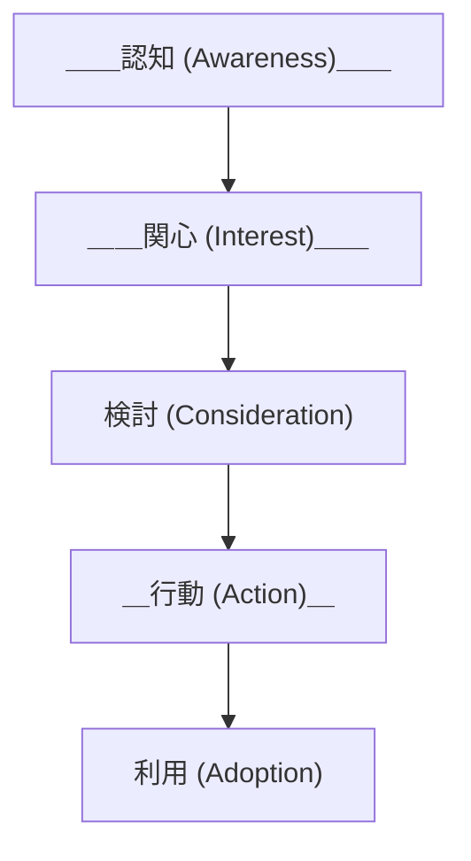

こんにちは。ソフトウェアエンジニアの id:masutaka26:detail です。

最近 ROUTE06 では、Giselle と Liam というプロジェクトを OSS 化しました。

* https://github.com/giselles-ai/giselle
* https://github.com/liam-hq/liam

これから OSS 活動を進めるにあたり、その指標を定義し計測することは、プロジェクトの成長やユーザーとのエンゲージメントを理解し、改善点を見出すために重要です。

本記事では、OSS マーケティングにおける成果を測定するための指標と、それらの相関性、取得可能な指標の範囲について考察していきます。

## 指標の種類

GitHub で OSS マーケティングの成果を評価する指標は、以下の 5 つのカテゴリに分類されると考えました。これらの指標を通じて、プロジェクトの認知から利用までのユーザーの行動を追跡し、マーケティング活動の効果を確認します。

### 1. 認知 (Awareness)

プロジェクトがどの程度のユーザーに認知されているかを把握するための指標です。

* Views
    * リポジトリへのアクセス数の総計。1 人のユーザーが複数回訪問すると、その回数分カウントされる
* Unique views
    * リポジトリへのユニークなアクセス数の総計。1 人のユーザーが複数回訪問しても、1 回とカウントされる

### 2. 関心 (Interest)

プロジェクトに対して興味を持ったユーザーの数を示す指標です。

* Stars
    * ユーザーがリポジトリに付けた Star の総数。1 人のユーザーは 1 つだけ Star を付けられる
    * リポジトリへの支持や関心への表れを示す、見込みユーザー数
* Watchers
    * リポジトリを Watch しているユーザー数
    * リポジトリの最新情報に関心を持つ、見込みユーザー数

### 3. 検討 (Consideration)

プロジェクトの利用や参加を具体的に検討しているユーザーを表す指標です。

* Clones
    * ユーザーがリポジトリを clone した総数
    * リポジトリの内容を詳しく確認したり、利用したりする、見込みユーザー数
* Forks
    * ユーザーが GitHub 上でリポジトリをフォークした総数
    * リポジトリに独自の変更を加えたり、pull request を作成したり、学習や参考にする、見込みユーザー数

### 4. 行動 (Action)

プロジェクトに実際に参加したり、貢献したりする行動を示す指標です。

* Issues（by 外部ユーザー）
    * バグ報告や、新機能のリクエストなど、リポジトリの改善や発展に貢献したい、見込みユーザー数
* Pull Requests（by 外部ユーザー）
    * 行動段階の最終ステップ。リポジトリの成長や品質向上への意欲が強く、技術的なスキルや知識を持っている、見込みユーザー数

### 5. 利用 (Adoption)

プロジェクトの実際の利用状況を測定する指標です。※ npm 等のパッケージの場合のみ

* リポジトリのダウンロード数
    * リポジトリを実際に使用する、見込みユーザー数

## ファネル構造と近いが異なる相関性

前述の指標は、認知から利用に至るまでのユーザーの行動を表しており、ファネル構造に近い流れです。

しかし、OSS プロジェクトの特性上、一般的なマーケティングファネルとは異なる相関性を持っています。

* 段階の進行が直線的でない
    * ユーザーは、必ずしも認知から順を追って利用まで進むわけではありません。例えば、認知段階で知った直後にダウンロードして利用するユーザーも存在し、時にはファネルの段階を飛ばして行動が進むこともあります
* 循環的な関係
    * OSS プロジェクトでは、利用したユーザーが再び関心や行動段階に戻ることもあり、従来のファネル構造よりも循環的です。利用ユーザーがプロジェクトにフィードバックを提供したり、新しいスターを付けたりするケースも多いため、相互に影響し合う関係性が見られます
* 指標の相互依存
    * 例えば、利用が進むことで認知や関心が高まるように、各段階の指標は相互に関連しています。そのため、OSS マーケティングでは個別の指標の変動だけでなく、全体的なバランスも意識する必要があります

## 取得可能な指標の範囲

GitHub 上で、OSS プロジェクトのマーケティング成果を測るために取得できる指標には、いくつかの限界があります。

### 1. 認知 (Awareness)

* Views
    * REST API [Get page views](https://docs.github.com/ja/rest/metrics/traffic?apiVersion=2022-11-28#get-page-views) の `count` で取得可能。期間は直近 2 週間のみ
    * リポジトリ `Insights` タブの `Traffic` から同様の数値が得られる
* Unique views
    * 同 REST API の `uniques` で取得可能。期間は直近 2 週間のみ
    * リポジトリ `Insights` タブの `Traffic` から同様の数値が得られる

💡 自分や Organization メンバーの訪問もカウントされるようです。

* [Does the GitHub traffic graph include your own views? \- Stack Overflow](https://stackoverflow.com/questions/22839597/does-the-github-traffic-graph-include-your-own-views)

### 2. 関心 (Interest)

* Stars
    * REST API [List stargazers](https://docs.github.com/ja/rest/activity/starring?apiVersion=2022-11-28#list-stargazers) で取得可能。全期間について、いつ誰がスターしたかも取得可能
* Watchers
    * REST API [List watchers](https://docs.github.com/ja/rest/activity/watching?apiVersion=2022-11-28#list-watchers) で、現在の Watchers のみ取得可能

### 3. 検討 (Consideration)

* Clones
    * REST API [Get repository clones](https://docs.github.com/ja/rest/metrics/traffic?apiVersion=2022-11-28#get-repository-clones) の `count` で取得可能。`uniques` でユニーククローン数も取得可能。いずれも期間は直近 2 週間のみ
    * リポジトリ `Insights` タブの `Traffic` から同様の数値が得られる
* Forks
    * REST API [List forks](https://docs.github.com/ja/rest/repos/forks?apiVersion=2022-11-28#list-forks) で取得可能。全期間について、いつ誰がフォークしたかも取得可能
    * リポジトリ `Insights` タブの `Forks` から同様の数値が得られる

💡 Clones については、GitHub Actions での actions/checkout 等の実行数も含まれるようです。

* [Do GitHub Actions contribute to a repo's Traffic stats under Insights? · community · Discussion \#23806](https://github.com/orgs/community/discussions/23806)

### 4. 行動 (Action)

* Issues（by 外部ユーザー）
    * REST API [List repository issues](https://docs.github.com/ja/rest/issues/issues?apiVersion=2022-11-28#list-repository-issues) で取得可能。全期間について、いつ誰が Issue を作ったかも取得可能
* Pull Requests（by 外部ユーザー）
    * REST API [List pull requests](https://docs.github.com/ja/rest/pulls/pulls?apiVersion=2022-11-28#list-pull-requests) で取得可能。全期間について、いつ誰が Pull request を作ったかも取得可能

### 5. 利用 (Adoption)

* プロジェクトのダウンロード数
    * GitHub 上では把握が難しいため、パッケージ管理システム（例：npm や PyPI）でのダウンロード数を参考にすることが一般的

## まとめ

OSS 活動の指標を GitHub リポジトリデータから考察しました。

前述のとおり、Views, Unique views, Clones は直近 2 週間の数値しか取得できません。次回はこちらの課題を解決した方法を紹介する予定です。

## 補足: OSS 化した Giselle と Liam

今回 OSS 化した [giselles-ai/giselle](https://github.com/giselles-ai/giselle) は、生成 AI を活用したエージェントやワークフローをノーコードで構築できる Giselle のリポジトリです。Giselle のサービスサイト https://giselles.ai/ で、詳細な情報を確認できます。

[liam-hq/liam](https://github.com/liam-hq/liam) は、綺麗で見やすい ER 図を簡単に自動生成できる Liam のリポジトリです。Liam のサービスサイトは https://liambx.com/ です。
