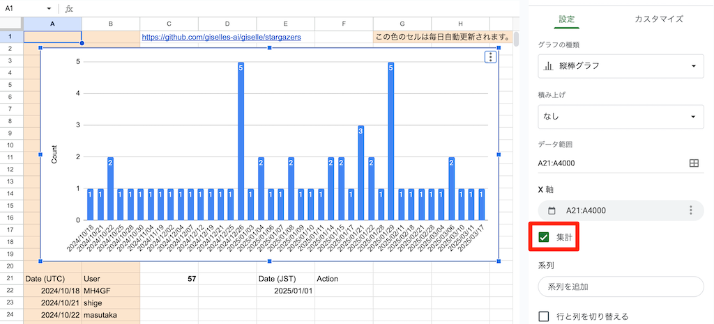
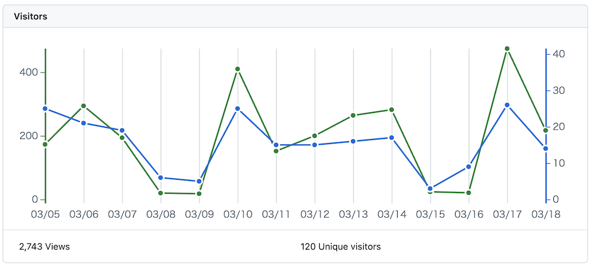
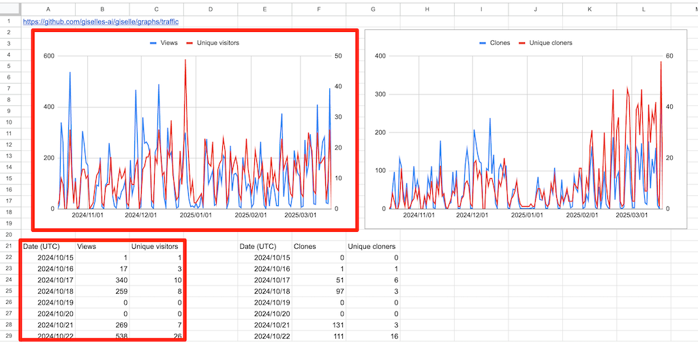
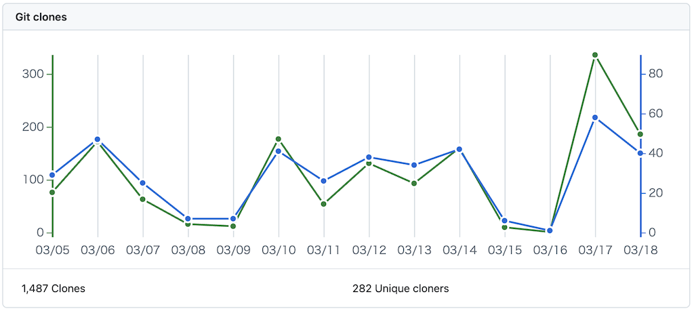
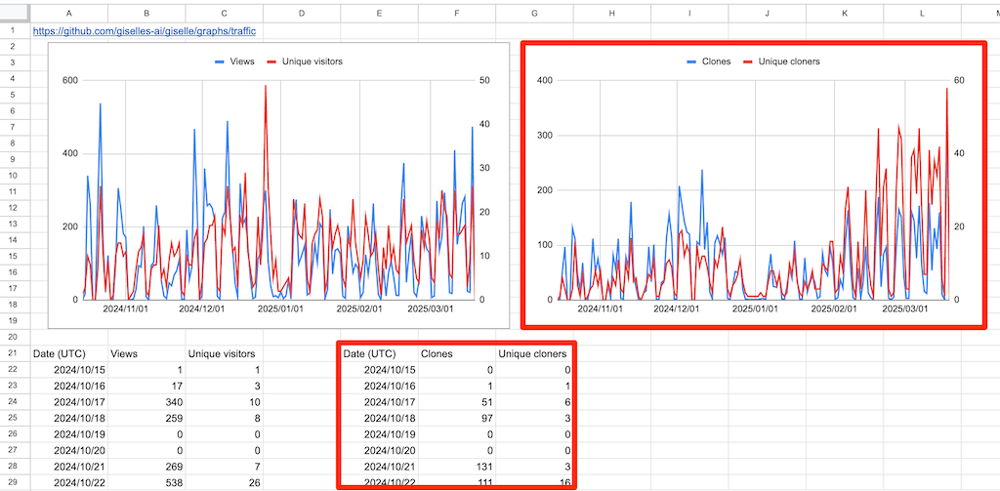
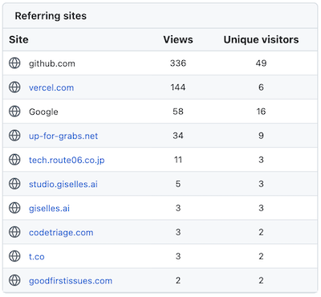
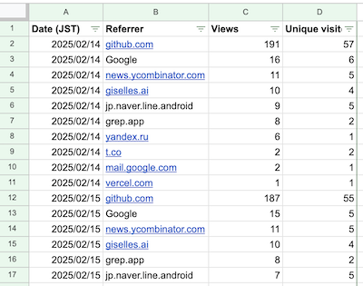
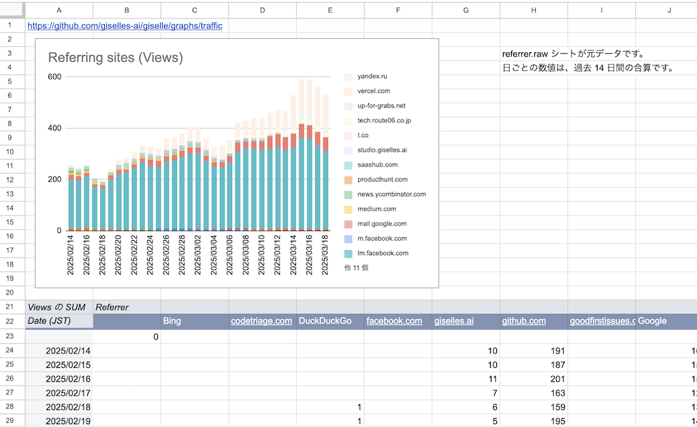
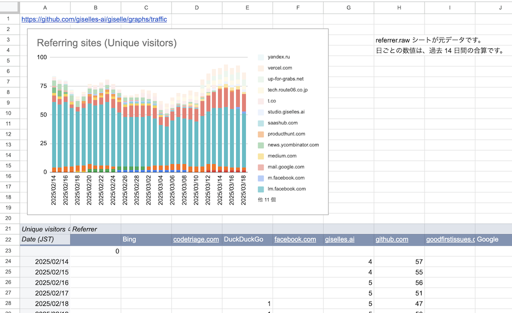

こんにちは。ソフトウェアエンジニアの id:masutaka26:detail です。

以前、OSS 活動の指標（メトリクス）を GitHub のリポジトリデータから考察しました。

https://tech.route06.co.jp/entry/2024/12/11/110000

それを踏まえて、GitHub リポジトリのトラフィックデータを継続的に蓄積する Google Apps Script (GAS) を実装しました。

https://tech.route06.co.jp/entry/2024/12/19/120000

今回は他のメトリクスを蓄積する GAS も追加しつつ、OSS としてリポジトリを公開したので、改めて紹介します。

## 公開したリポジトリ

公開したリポジトリはこちらです。

https://github.com/route06inc/ospo-google-apps-script

最初のセットアップ方法は [README](https://github.com/route06inc/ospo-google-apps-script#readme) にまとめたので、なぜ蓄積することにしたのかを中心に書いていきます。

## 蓄積しているメトリクス

### 1. Stargazers

#### やりたいこと

* 日毎のスター増加数を把握したい
* スターが増えた日と、要因や施策を関連付けたい

#### 課題感

* GitHub の Web UI では、スターの総数とスターした GitHub アカウントしか分からない
    * 例: https://github.com/giselles-ai/giselle/stargazers
* Star History だと、近くの日が丸められてしまう。メモも書くことも出来ない
    * 例: https://www.star-history.com/#giselles-ai/giselle&Date

#### 解決策

[updateSheetWithStargazers](https://github.com/route06inc/ospo-google-apps-script/blob/d693ef5f6c8526f2c803500a5815d925bc98ee7f/lib/star_service.js#L1-L22) 関数を実装し、何月何日に誰がスターしたかを記録した。

グラフは以下のように作成した。X 軸の「集計」を有効にするのがポイント。色がついたセル以外は、自由にメモを書くことも出来る。

### 2. Traffic views

#### やりたいこと

* リポジトリの Insights → Traffic の `Visitors` グラフの数値を、恒久的に蓄積したい
    * `https://github.com/[ORG]/[REPO]/graphs/traffic`

#### 課題感

* このグラフでは、2 週間より前の数値が分からない
* GitHub REST API [Get traffic views](https://docs.github.com/rest/metrics/traffic?apiVersion=2022-11-28#get-page-views) も同様

#### 解決策

この API を使用する [updateSheetWithLatestTrafficViews](https://github.com/route06inc/ospo-google-apps-script/blob/d693ef5f6c8526f2c803500a5815d925bc98ee7f/lib/traffic_service.js#L1-L15) 関数を実装し、日毎の Views と Unique visitors をスプレッドシートに蓄積した。

### 3. Traffic clones

#### やりたいこと

* リポジトリの Insights → Traffic の `Git clones` グラフの数値を、恒久的に蓄積したい
    * `https://github.com/[ORG]/[REPO]/graphs/traffic`

#### 課題感

* このグラフでは、2 週間より前の数値が分からない
* GitHub REST API [Get traffic clones](https://docs.github.com/rest/metrics/traffic?apiVersion=2022-11-28#get-repository-clones) も同様

#### 解決策

この API を使用する [updateSheetWithLatestTrafficClones](https://github.com/route06inc/ospo-google-apps-script/blob/d693ef5f6c8526f2c803500a5815d925bc98ee7f/lib/traffic_service.js#L17-L31) 関数を実装し、日毎の Clones と Unique cloners をスプレッドシートに蓄積した。

### 4. Top referral sources

#### やりたいこと

* リポジトリの Insights → Traffic の `Referring sites` グラフの数値を、恒久的に蓄積したい
    * `https://github.com/[ORG]/[REPO]/graphs/traffic`

#### 課題感

* このグラフでは、2 週間より前の数値が分からない
* GitHub REST API [Get top referral sources](https://docs.github.com/rest/metrics/traffic?apiVersion=2022-11-28#get-top-referral-sources) も同様
* 各数値は過去 14 日分の合算であり、使い勝手が悪い

#### 解決策

この API を使用する [updateSheetWithLatestTrafficReferrers](https://github.com/route06inc/ospo-google-apps-script/blob/d693ef5f6c8526f2c803500a5815d925bc98ee7f/lib/traffic_service.js#L33-L51) 関数を実装し、日毎の Referring sites をスプレッドシートに蓄積した。

積み上げグラフにするために、別シートに Views と Unique visitors のピボットテーブルと、それぞれのグラフを作った。

各数値が過去 14 日分の合算である件は未解決だが、表計算でバラすことは出来そう。

## まとめ

GitHub リポジトリのメトリクスを継続的に蓄積する GAS を OSS リポジトリ https://github.com/route06inc/ospo-google-apps-script として公開しました。

実際に Giselle と Liam のリポジトリで日々蓄積しており、データを活用できつつあります。

* https://github.com/giselles-ai/giselle
* https://github.com/liam-hq/liam
