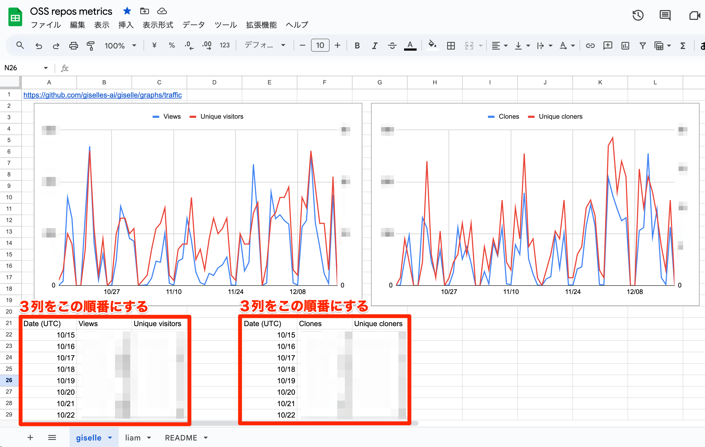
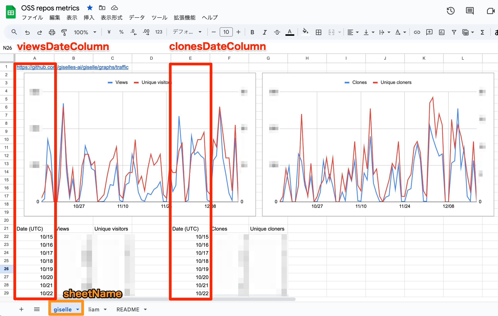

こんにちは。ソフトウェアエンジニアの id:masutaka26:detail です。

前回は OSS 活動に関係する指標のうち、取得期間に制限のある数値に言及しました。

> 前述のとおり、Views, Unique views, Clones は直近 2 週間の数値しか取得できません。次回はこちらの課題を解決した方法を紹介する予定です。

https://tech.route06.co.jp/entry/2024/12/11/110000

今回は Google Apps Script (GAS) を使って、Google スプレッドシートにこれらの数値を 2 週間以上蓄積する方法を紹介します。

## Google スプレッドシートを作成する

以下のように、1 シート 1 リポジトリでスプレッドシートを作成します。今回は [giselle](https://github.com/giselles-ai/giselle) と [liam](https://github.com/liam-hq/liam) 用のシートを作成しました。



Traffic データは、リポジトリ Insights タブの Traffic サイドバーで確認できます。以下は例です。

* https://github.com/giselles-ai/giselle/graphs/traffic
* https://github.com/liam-hq/liam/graphs/traffic

グラフを見ながら手動で入力するのは少し手間がかかるため、[gh CLI](https://docs.github.com/github-cli) の利用をおすすめします。

**直近 2 週間の Views と Unique visitors の取得例:**

```bash
$ gh api -H "Accept: application/vnd.github.v3.star+json" \
   /repos/giselles-ai/giselle/traffic/views \
  | jq -r '["Date", "Views", "Unique visitors"],(.views[] | [.timestamp, .count, .uniques]) | @csv' \
  | sed -e 's/T00:00:00Z//g'
"Date","Views","Unique visitors"
"2024-12-03",33,7
"2024-12-04",273,17
(snip)
```

**直近 2 週間の Clones と Unique cloners の取得例:**

```bash
$ gh api -H "Accept: application/vnd.github.v3.star+json" \
   /repos/giselles-ai/giselle/traffic/clones \
  | jq -r '["Date", "Clones", "Unique cloners"],(.clones[] | [.timestamp, .count, .uniques]) | @csv' \
  | sed -e 's/T00:00:00Z//g'
"Date","Clones","Unique cloners"
"2024-12-03",12,5
"2024-12-04",148,12
(snip)
```

それぞれ、以下の GitHub REST API を使用しています。

* [Get page views \| REST API endpoints for repository traffic \- GitHub Doc](https://docs.github.com/rest/metrics/traffic?apiVersion=2022-11-28#get-page-views)
* [Get repository clones \| REST API endpoints for repository traffic \- GitHub Doc](https://docs.github.com/rest/metrics/traffic?apiVersion=2022-11-28#get-repository-clones)

## GitHub App Access Token を使用する

GitHub API を使用するためには、Access Token が必要です。

Personal Access Token を使うのがお手軽ですが、Classic と Fine-grained いずれも、以下の課題があります。

* GitHub ユーザーに紐づく運用面の課題
* 生存期間が長いセキュリティ面の課題

そのため、今回は専用の GitHub App を作成し、GAS 実行のたびに生存期間の短い Access Token を発行しました。

## GitHub App を作成する

公式ドキュメントに従い、GitHub App を作成し、必要なリポジトリにインストールしてください。

🔗 [Registering a GitHub App \- GitHub Docs](https://docs.github.com/apps/creating-github-apps/registering-a-github-app/registering-a-github-app)

必要な権限は以下のみです。

* Administration Read-only
* Metadata Read-only

Webhook は使わないので、Active のチェックは外してください。

作成が完了したら、以下もお願いします。

* App ID を控える
* Private key を作成し、ローカルにダウンロードする

## GAS を実装する

スプレッドシートを開き、メニューの「拡張機能」から「Apps Script」をクリックしてください。

2 つのファイルを作成し、それぞれ以下のコードを貼り付けます。

### main.gs

```javascript
// Copyright (c) 2024 ROUTE06, Inc.
//
// Licensed under the Apache License, Version 2.0 (the "License");
// you may not use this file except in compliance with the License.
// You may obtain a copy of the License at
//
//     https://www.apache.org/licenses/LICENSE-2.0
//
// Unless required by applicable law or agreed to in writing, software
// distributed under the License is distributed on an "AS IS" BASIS,
// WITHOUT WARRANTIES OR CONDITIONS OF ANY KIND, either express or implied.
// See the License for the specific language governing permissions and
// limitations under the License.

const COLLECTION_TARGETS = [
  {
    repo: 'giselles-ai/giselle',
    sheetName: 'giselle',
    viewsDateColumn: 'A',
    clonesDateColumn: 'E',
  },
  {
    repo: 'liam-hq/liam',
    sheetName: 'liam',
    viewsDateColumn: 'A',
    clonesDateColumn: 'E',
  },
];

const main = () => {
  COLLECTION_TARGETS.forEach(updateSheetWithLatestData);
};

/**
 * Update Google Sheet with latest GitHub data
 *
 * @param {string} repo - GitHub Repository name (e.g., 'giselles-ai/giselle')
 * @param {string} sheetName - (e.g., 'giselle')
 * @param {string} viewsDateColumn - (e.g., 'A')
 * @param {string} clonesDateColumn - (e.g., 'E')
 * @return {void}
 */
const updateSheetWithLatestData = ({repo = undefined, sheetName = undefined, viewsDateColumn = undefined, clonesDateColumn = undefined}) => {
  updateSheetWithLatestTrafficViews({repo, sheetName, column: viewsDateColumn});
  updateSheetWithLatestTrafficClones({repo, sheetName, column: clonesDateColumn});
};

/**
 * Update Google Sheet with latest traffic views
 *
 * @param {string} repo - GitHub Repository name (e.g., 'giselles-ai/giselle')
 * @param {string} sheetName - (e.g., 'giselle')
 * @param {string} column - (e.g., 'A')
 * @return {void}
 */
const updateSheetWithLatestTrafficViews = ({repo = undefined, sheetName = undefined, column = undefined}) => {
  const trafficViews = GitHubGetTrafficViews({repo});
  const converted = convertTimestampToDate(trafficViews.views);
  updateSheetWithLatestCore({actualData: converted, sheetName, column})
};

/**
 * Update Google Sheet with latest traffic clones
 *
 * @param {string} repo - GitHub Repository name (e.g., 'giselles-ai/giselle')
 * @param {string} sheetName - (e.g., 'giselle')
 * @param {string} column - (e.g., 'E')
 * @return {void}
 */
const updateSheetWithLatestTrafficClones = ({repo = undefined, sheetName = undefined, column = undefined}) => {
  const trafficClones = GitHubGetTrafficClones({repo});
  const converted = convertTimestampToDate(trafficClones.clones);
  updateSheetWithLatestCore({actualData: converted, sheetName, column})
};

/**
 * Update Google Sheet with the data passed as argument
 *
 * @param {Array.<{date: Date, count: number, uniques: number}>} actualData
 * @param {string} sheetName - (e.g., 'giselle')
 * @param {string} column - (e.g., 'E')
 * @return {void}
 */
const updateSheetWithLatestCore = ({actualData = undefined, sheetName = undefined, column = undefined}) => {
  const earliestDate = getEarliestDate(actualData);
  const blankData = buildBlankData(earliestDate);
  const completeData = mergeActualAndBlank(actualData, blankData);

  let curDateCell = vlookupWithDate({sheetName, column, targetDate: earliestDate});

  completeData.forEach((e) => {
    const formattedDate = e.date.toISOString().split('T')[0]; // YYYY-MM-DD
    const curCountCell = getCountCell(curDateCell);
    const curUniquesCell = getUniquesCell(curDateCell);

    console.log(`[Write] ${curDateCell.getA1Notation()}: ${formattedDate},  ${curCountCell.getA1Notation()}: ${e.count},  ${curUniquesCell.getA1Notation()}: ${e.uniques}`);

    curDateCell.setValue(formattedDate);
    curCountCell.setValue(e.count);
    curUniquesCell.setValue(e.uniques);

    curDateCell = getNextDateCell(curDateCell);
  });
};

class DateNotFoundError extends Error {}

/**
 * Searches the specified column vertically and returns cell names matching the specified date
 *
 * @param {string} sheetName - (e.g., 'giselle')
 * @param {string} column - (e.g., 'A')
 * @param {Date} targetDate
 * @return {Range} - (e.g., the range of 'A31')
 */
const vlookupWithDate = ({sheetName = undefined, column = undefined, targetDate = undefined}) => {
  const sheet = SpreadsheetApp.getActiveSpreadsheet().getSheetByName(sheetName);
  const range = sheet.getRange(`${column}:${column}`); // Get the entire column range
  const values = range.getValues();

  const rowIndex = values.findIndex(row => row[0] instanceof Date && row[0].toDateString() === targetDate.toDateString());

  if (rowIndex == -1) {
    throw new DateNotFoundError;
  }

  return sheet.getRange(`${column}${rowIndex + 1}`);
};

const getCountCell = dateCell => dateCell.offset(0, 1);
const getUniquesCell = dateCell => dateCell.offset(0, 2);
const getNextDateCell = dateCell => dateCell.offset(1, 0);


/**
 * Convet timestamp to date
 *
 * @param {Array.<{timestamp: string, count: number, uniques: number}>} data
 * @return {Array.<{date: Date, count: number, uniques: number}>}
 */
const convertTimestampToDate = data => {
  return data.map(item => ({
    date: new Date(item.timestamp),
    count: item.count,
    uniques: item.uniques,
  }));
};

/**
 * Merge actual data and blank data
 *
 * @param {Array.<{date: Date, count: number, uniques: number}>} actual
 * @param {Array.<{date: Date, count: 0, uniques: 0}>} blank
 * @return {Array.<{date: Date, count: number, uniques: number}>}
 */
const mergeActualAndBlank = (actual, blank) => {
  return blank.map(blankItem => {
    // Find data matching date in `actual`
    const actualItem = actual.find(a => a.date.toDateString() === blankItem.date.toDateString());
    // If `actual` data is available, it is given priority; otherwise, `blank` data is used.
    return actualItem || blankItem;
  });
};

/**
 * Get earliest date
 *
 * @param {Array.<{date: Date, count: number, uniques: number}>} data
 * @return {Date}
 */
const getEarliestDate = data => {
  return new Date(
    data.reduce(
      (first, current) => current.date < first ? current.date : first,
      data[0].date
    )
  );
};

/**
 * Build blank data
 *
 * @param {Date} inStartDate
 * @return {Array.<{date: Date, count: 0, uniques: 0}>}
 */
const buildBlankData = inStartDate => {
  const result = [];
  const today = new Date();
  const startDate = new Date(inStartDate); // Don't let the argument values change

  for (let i = startDate; i < today; i.setDate(i.getDate() + 1)) {
    result.push({ date: new Date(i), count: 0, uniques: 0 });
  }

  return result;
};
```

### github.gs

```javascript
// Copyright (c) 2024 ROUTE06, Inc.
//
// Licensed under the Apache License, Version 2.0 (the "License");
// you may not use this file except in compliance with the License.
// You may obtain a copy of the License at
//
//     https://www.apache.org/licenses/LICENSE-2.0
//
// Unless required by applicable law or agreed to in writing, software
// distributed under the License is distributed on an "AS IS" BASIS,
// WITHOUT WARRANTIES OR CONDITIONS OF ANY KIND, either express or implied.
// See the License for the specific language governing permissions and
// limitations under the License.

const GITHUB_APP_ID = PropertiesService.getScriptProperties().getProperty('GITHUB_APP_ID');
const GITHUB_APP_PRIVATE_KEY = PropertiesService.getScriptProperties().getProperty('GITHUB_APP_PRIVATE_KEY');

/**
 * Get traffic views
 *
 * @param {string} repo - GitHub Repository name (e.g., 'giselles-ai/giselle')
 * @return {Object}
 * @see https://docs.github.com/rest/metrics/traffic?apiVersion=2022-11-28#get-page-views
 */
const GitHubGetTrafficViews = ({repo = undefined}) => {
  return gitHubApiGet({
    repo: repo,
    path: `/repos/${repo}/traffic/views`,
  });
};

/**
 * Get traffic clones
 *
 * @param {string} repo - GitHub Repository name (e.g., 'giselles-ai/giselle')
 * @return {Object}
 * @see https://docs.github.com/rest/metrics/traffic?apiVersion=2022-11-28#get-repository-clones
 */
const GitHubGetTrafficClones = ({repo = undefined}) => {
  return gitHubApiGet({
    repo: repo,
    path: `/repos/${repo}/traffic/clones`,
  });
};

/**
 * Call [GET] GitHub API
 *
 * @param {string} repo - GitHub Repository name (e.g., 'giselles-ai/giselle')
 * @param {string} path - the API path (e.g., /repos/giselles-ai/giselle/traffic/views)
 * @return {Object}
 */
const gitHubApiGet = ({repo = undefined, path = undefined}) => {
  const token = createGitHubAppToken(repo);

  const response = UrlFetchApp.fetch(
    `https://api.github.com${path}`,
    {
      method: 'GET',
      headers: {
        'Accept': 'application/vnd.github+json',
        'Authorization': `token ${token}`,
        'X-GitHub-Api-Version': '2022-11-28',
      },
    },
  );

  return JSON.parse(response);
};

/**
 * Create GitHub App installation access token
 *
 * @param {string} repo - GitHub Repository name (e.g., 'giselles-ai/giselle')
 * @return {string}
 * @see https://docs.github.com/apps/creating-github-apps/authenticating-with-a-github-app/generating-an-installation-access-token-for-a-github-app
 * @see https://docs.github.com/rest/apps/apps?apiVersion=2022-11-28#create-an-installation-access-token-for-an-app
 * @note Use Closure to cache the App Tokens by repo
 */
const createGitHubAppToken = (() => {
  const tokenCache = new Map();

  return repo => {
    if (tokenCache.has(repo)) {
      console.log(`Hit the cache for the GitHub App Token for repo ${repo} `);
      return tokenCache.get(repo);
    }

    const jwt = createJWT({
      app_id: GITHUB_APP_ID,
      private_key: GITHUB_APP_PRIVATE_KEY,
    });

    const installationID = getGitHubAppInstallationID({repo, jwt});
    console.log(`repo: ${repo}, installationID: ${installationID}`);

    const response = UrlFetchApp.fetch(
      `https://api.github.com/app/installations/${installationID}/access_tokens`,
      {
        method: 'POST',
        headers: {
          'Accept': 'application/vnd.github+json',
          'Authorization': `Bearer ${jwt}`,
          'X-GitHub-Api-Version': '2022-11-28',
        }
      },
    );

    const token = JSON.parse(response.getContentText()).token;
    tokenCache.set(repo, token);
    console.log(`Cached GitHub App Token for repo ${repo}`);

    return token;
  };
})();

/**
 * Create JWT
 *
 * @param {string} app_id - GitHub App ID
 * @param {string} private_key - GitHub App private key
 * @return {string}
 * @see https://docs.github.com/apps/creating-github-apps/authenticating-with-a-github-app/generating-a-json-web-token-jwt-for-a-github-app
 */
const createJWT = ({app_id = undefined, private_key = undefined}) => {
  const now = Math.floor(new Date().getTime() / 1000);
  const iat = now - 60;  // Issues 60 seconds in the past
  const exp = now + 600; // Expires 10 minutes in the future

  const headerJSON = {
    typ: 'JWT',
    alg: 'RS256',
  };
  const header = Utilities.base64EncodeWebSafe(JSON.stringify(headerJSON));

  const payloadJSON = {
    iat: iat,
    exp: exp,
    iss: app_id,
  };
  const payload = Utilities.base64EncodeWebSafe(JSON.stringify(payloadJSON));

  const headerPayload = `${header}.${payload}`;
  const signature = Utilities.base64EncodeWebSafe(Utilities.computeRsaSha256Signature(headerPayload, private_key));

  return `${headerPayload}.${signature}`;
};

/**
 * Get a repository installation ID for the authenticated app
 *
 * @param {string} repo - GitHub Repository name (e.g., 'giselles-ai/giselle')
 * @param {string} jwt
 * @return {string}
 * @see https://docs.github.com/rest/apps/apps?apiVersion=2022-11-28#get-a-repository-installation-for-the-authenticated-app
 */
const getGitHubAppInstallationID = ({repo = undefined, jwt = undefined}) => {
  const response = UrlFetchApp.fetch(
    `https://api.github.com/repos/${repo}/installation`,
    {
      method: 'GET',
      headers: {
        'Accept': 'application/vnd.github+json',
        'Authorization': `Bearer ${jwt}`,
        'X-GitHub-Api-Version': '2022-11-28',
      }
    },
  );

  return JSON.parse(response.getContentText()).id;
};
```

貼り付けたら、main.gs の定数 `COLLECTION_TARGETS` をご自分の情報に変更してください。

```javascript
const COLLECTION_TARGETS = [
  {
    repo: 'giselles-ai/giselle',
    sheetName: 'giselle',
    viewsDateColumn: 'A',
    clonesDateColumn: 'E',
  },
  {
    repo: 'liam-hq/liam',
    sheetName: 'liam',
    viewsDateColumn: 'A',
    clonesDateColumn: 'E',
  },
];
```



## GAS にスクリプトプロパティを設定する

GAS サイドメニューの「⚙️プロジェクトの設定」をクリックし、スクリプトプロパティを設定していきます。

### GITHUB_APP_ID

スクリプトプロパティ `GITHUB_APP_ID` を追加し、値に前述の App ID を設定してください。

### GITHUB_APP_PRIVATE_KEY

前述の Private Key を `PKCS#1` 形式から、GAS が要求する `PKCS#8` 形式に変換します。`GITHUB.PRIVATE-KEY.pem` と `GAS.PRIVATE-KEY.pem` は適宜置換してください。

```console
$ openssl pkcs8 -topk8 -inform PEM -outform PEM -in GITHUB.PRIVATE-KEY.pem -out GAS.PRIVATE-KEY.pem -nocrypt
```

次に GAS で一時的な以下のコードを作成します。

```javascript
const TMP_PRIVATE_KEY = `
GAS.PRIVATE-KEY.pem の中身を貼り付ける
`;

const setKey = () => {
  PropertiesService.getScriptProperties().setProperty('GITHUB_APP_PRIVATE_KEY', TMP_PRIVATE_KEY);
};
```

メニューから `setKey` 関数を選択し、実行してください。スクリプトプロパティ `GITHUB_APP_PRIVATE_KEY` が作成されるはずです。作成されたら、上記コードは削除してください。

💡 「⚙️プロジェクトの設定」から設定すると、GAS 実行時に `Exception: Invalid argument: key` エラーが発生します。GAS 側で、改行コードの扱いに問題がありそうです。他のスクリプトプロパティを変更した場合でも、再設定が必要のようです。

## 定期実行するためのトリガーを作成する

GAS サイドメニューの「🕓トリガー」をクリックし、定期実行するためのトリガーを作成します。

* 実行する関数を選択
    * `main`
* イベントのソースを選択
    * `時間主導型`
* 時間ベースのトリガーのタイプを選択
    * `日付ベースのタイマー`
* 時刻を選択
    * （例）`午前 9 時 〜 10 時`
* エラー通知設定
    * `今すぐ通知を受け取る`

これで、毎日 1 回スプレッドシートが自動更新されます。エラー発生時にはご自分のメールアドレスに通知されます。

## まとめ

OSS 活動に関係する指標のうち、取得期間に制限のある `Views`, `Unique views`, `Clones`, `Unique clones` を Google スプレッドシートに蓄積する方法を紹介しました。

* 複数リポジトリの Traffic データを Google スプレッドシートに一元管理
* 2 週間以上のデータを保持可能
* 自動化による運用負荷の軽減
* GitHub App による安全な認証

皆さんの参考になれば幸いです。

## 補足: Giselle と Liam

Google スプレッドシート作成で言及した [giselles-ai/giselle](https://github.com/giselles-ai/giselle) は、生成 AI を活用したエージェントやワークフローをノーコードで構築できる Giselle のリポジトリです。Giselle のサービスサイト https://giselles.ai/ で、詳細な情報を確認できます。

[liam-hq/liam](https://github.com/liam-hq/liam) は、綺麗で見やすい ER 図を簡単に自動生成できる Liam のリポジトリです。Liam のサービスサイトは https://liambx.com/ です。
