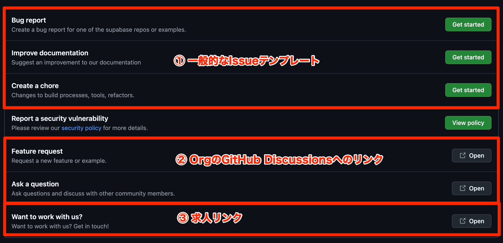
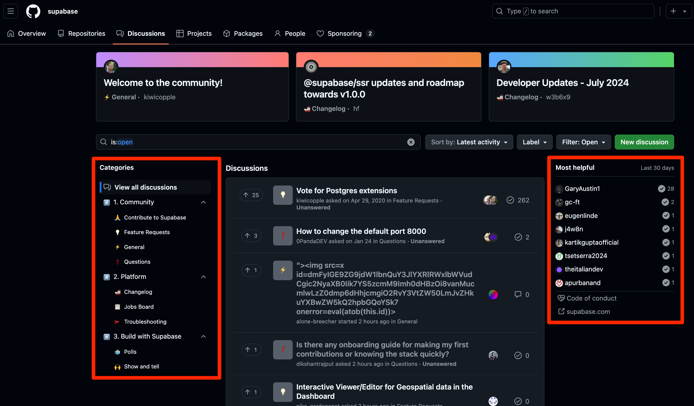

こんにちは。ソフトウェアエンジニアの id:masutaka26:detail です。最近は社内プロダクトの OSS 化を推進する活動をしています。

先日、GitHub の Issue テンプレートを調査しました。その中で Supabase が参考になったので共有します。

## 1. New Issue からの導線

これが Supabase の Issue テンプレートです。

🔗 https://github.com/supabase/supabase/issues/new/choose

②に興味を惹かれました。いずれも GitHub Organization の Discussions へのリンクです。

* [Feature request](https://github.com/orgs/supabase/discussions/categories/feature-requests?discussions_q=is%3Aopen+category%3A%22Feature+Requests%22+sort%3Atop)
    * Feature Requests のカテゴリで Discussion を作る
* [Ask a question](https://github.com/orgs/supabase/discussions/new/choose)
    * カテゴリを選んで Discussion を作る

ちなみに、[リポジトリの Discussions](https://github.com/supabase/supabase/discussions) は Org Discussions にリダイレクトされます。GitHub Organization の設定です。

③の求人リンクは自由で面白いと思いました。

### コラム: Issue テンプレートはどこにある？

[supabase/supabase](https://github.com/supabase/supabase) リポジトリには Issue テンプレートはなく、探したら [supabase/.github](https://github.com/supabase/.github) リポジトリにありました。

* [supabase/.github/.github/ISSUE_TEMPLATE/](https://github.com/supabase/.github/tree/9a8dabfea900e8b27fa618d21601740dcaa1c3ff/.github/ISSUE_TEMPLATE)

GitHub Organization の .github リポジトリは特別なリポジトリです。

ここに置いた Issue/PR テンプレートや、CONTRIBUTING.md、CODE_OF_CONDUCT.md などは、各リポジトリのデフォルトになります。

そのままで良ければ、各リポジトリで作らなくて OK です。変更したければ、各リポジトリで作ります。

Issue テンプレートは一点だけ注意事項があります。各リポジトリの `.github/ISSUE_TEMPLATE/` 以下に 1 つでも Issue テンプレートや、config.yml を置くと、.github リポジトリのものは無視されます。

## 2. Discussions のカテゴリ設計

こちらが Supabase Org の Discussions です。フォーラムのように設計されています。左側の `Categories` と右側の `Most helpful` に注目しました。

🔗 https://github.com/orgs/supabase/discussions

### Categories

コントリビュートを促したり、Changelog での活発なアップデート情報、Supabase 関連の求人や作ったものの披露など、非常に参考になりました。

1. Community
    * Contribute to Supabase
        * Supabase にコントリビュート出来そうな小さなタスクを共有
        * [Contributing guide](https://github.com/orgs/supabase/discussions/16754) もピン留めされている
    * Feature Requests
        * 新機能のアイデアを共有する
    * General
        * どこにも当てはまらないやつ
    * Questions
        * 質問はこちら。でもここ以外にも質問はある
2. Platform
    * Changelog
        * [GitHub Release](https://github.com/supabase/supabase/releases) に加えて、ここでも活発にアップデート情報を出している
    * Jobs Board
        * ここに Supabase 関連の求人を出しても良いらしい❗
    * Troubleshooting
        * トラブルシューティングがまとまっている
3. Build with Superbase
    * Polls
        * アンケートがいくつかある
    * Shows and tell
        * Supabase で作ったものを披露できる

See also [Default categories - GitHub Docs](https://docs.github.com/en/discussions/managing-discussions-for-your-community/managing-categories-for-discussions)

### Most helpful

質問や Feature リクエストのベストアンサーに選ばれた人のランキングです。

コントリビュートのモチベーションになるかも？

## まとめ

Supabase の GitHub 設計が参考になったので共有しました。

* GiHub Discussions をフォーラムのように使っている
* [supabase](https://github.com/supabase) Org には supabase 関連のリポジトリだけを置くため、以下のようになっている
    * 各リポジトリの Discussions（[例](https://github.com/supabase/supabase/discussions)）は、https://github.com/orgs/supabase/discussions にリダイレクトされる
    * https://github.com/supabase/.github リポジトリに、Issue/PR テンプレートや CONTRIBUTING.md を置き、各リポジトリのデフォルトとしている
