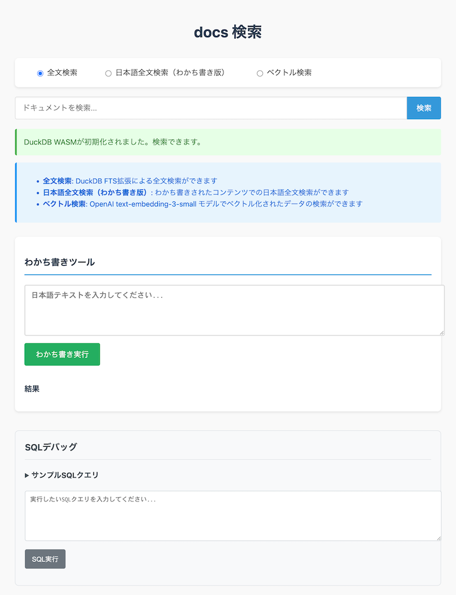
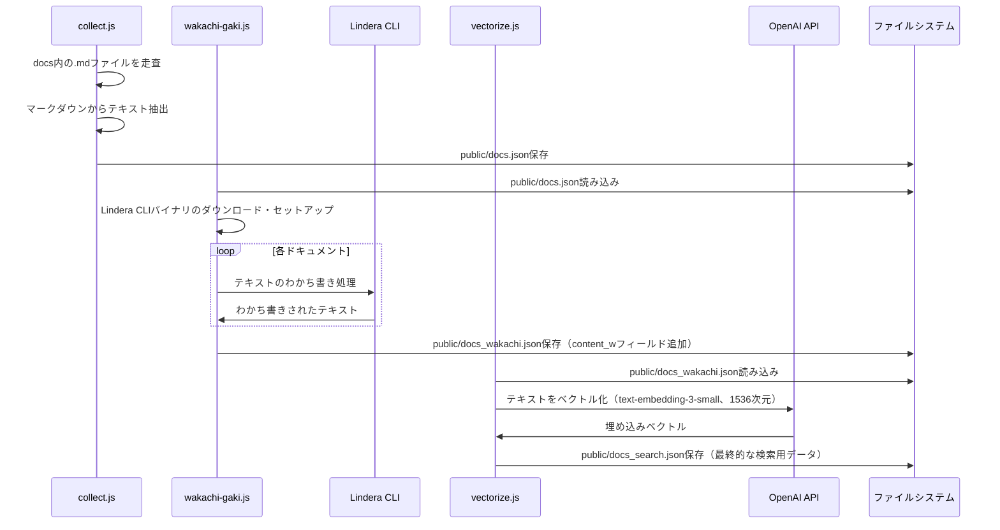
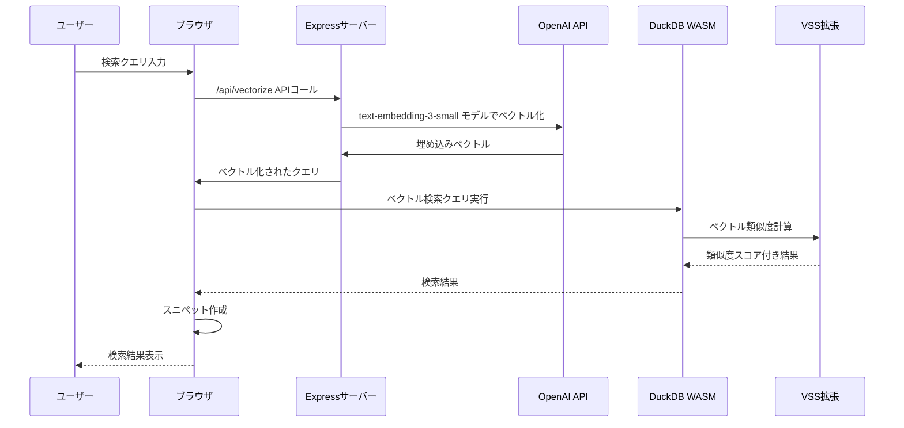
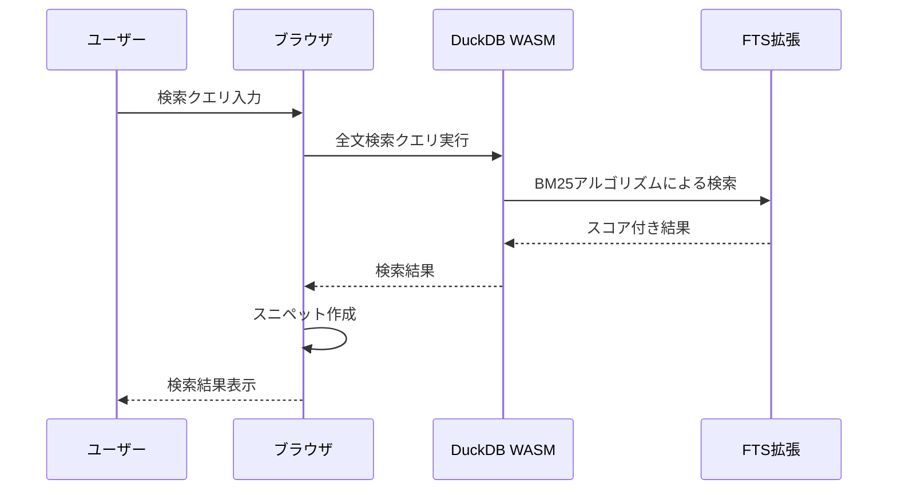

# DuckDB オフライン 検索

このプロジェクトは、DuckDB WASM とその拡張機能を使用して、docs ディレクトリ内のマークダウンファイルをブラウザから検索できるシステムです。以下の3種類の検索方法を提供しています：

1. **全文検索**: DuckDB FTS (Full-Text Search) 拡張を使用した全文検索
2. **日本語全文検索（わかち書き版）**: Linderaによるわかち書き処理とDuckDB FTS拡張を組み合わせた高精度な日本語検索
3. **ベクトル検索**: VSS (Vector Similarity Search) 拡張とOpenAI APIの`text-embedding-3-small`モデルでベクトル化されたデータを使用した高精度な意味検索



## 技術スタック

- **フロントエンド**: HTML + CSS + TypeScript
- **検索エンジン**: DuckDB WASM + VSS (Vector Similarity Search) 拡張 + FTS (Full-Text Search) 拡張
- **日本語形態素解析**: Lindera（わかち書き処理）
- **テキストベクトル化**: OpenAI API (`text-embedding-3-small`モデル)
- **バックエンド**: Express.js (開発モードのみ)
- **開発環境**: Node.js + npm + Webpack

## 開発環境のセットアップ

### 前提条件

- Node.js (v22)
- npm
- OpenAI API キー

### インストール手順

1. リポジトリをクローンし、依存関係をインストールします

```bash
npm install
```

### 環境変数の設定

`.env.example`ファイルをコピーして`.env`ファイルを作成し、必要な環境変数を設定します：

```bash
cp .env.example .env
```

`.env`ファイルを編集して必要な設定を行ってください。

### 初期データの構築

**一括実行（推奨）:**

```bash
# 全プロセスを一括実行
npm run build-db-all
```

**個別実行:**

1. ドキュメントを収集します

```bash
npm run collect
```

**入力**: `docs/` ディレクトリ内の `.md` ファイル  
**出力**: `public/docs.json`

2. ドキュメントをLinderaでわかち書きします

```bash
npm run wakachi-gaki
```

**入力**: `public/docs.json`  
**出力**: `public/docs_wakachi.json`

   このコマンドは：
   - Lindera CLIバイナリを自動ダウンロード・セットアップ（macOS、Linux、Windows対応）
   - 各ドキュメントを形態素解析してわかち書き
   - `content_w`フィールドを追加
   - エラー時は処理を中断して終了
   - 処理完了時に統計情報を表示
   
   環境変数で辞書の種類を選択可能：
   ```bash
   # IPADIC辞書（デフォルト）
   npm run wakachi-gaki
   
   # UniDic辞書
   LINDERA_VARIANT=cjk2 npm run wakachi-gaki
   
   # IPADIC NEologd辞書（新語・固有名詞対応）
   LINDERA_VARIANT=cjk3 npm run wakachi-gaki
   
   # ヘルプ表示
   npm run wakachi-gaki -- --help
   ```

3. わかち書きされたドキュメントをOpenAI APIでベクトル化します

```bash
npm run vectorize
```

**入力**: `public/docs_wakachi.json`  
**出力**: `public/docs_search.json` (最終的な検索用データ)

## 開発サーバーの起動

**ベクトル検索を使用する場合（推奨）:**

開発サーバーを起動します（フロントエンドとバックエンドを同時に起動）：

```bash
npm run dev
```

これにより以下のサーバーが起動します：

- フロントエンドサーバー: http://localhost:9000
- バックエンドサーバー: http://localhost:3000 (ベクトル検索用OpenAI APIプロキシ)

**全文検索・わかち書き検索のみ使用する場合:**

フロントエンドのみでも動作します：

```bash
npm run start
```

※ ベクトル検索を使用するにはバックエンドサーバーが必要です。

## アーキテクチャ

### 検索フロー（開発モード）

#### ベクトル検索

1. ユーザーが検索クエリを入力
2. 検索クエリがバックエンドAPIを通じてOpenAI APIで`text-embedding-3-small`モデルによってベクトル化
3. ベクトル化されたクエリを使用してDuckDBのVSS拡張でベクトル検索を実行
4. テキスト一致とベクトル検索結果を組み合わせたハイブリッド検索結果を返す

#### 日本語全文検索

1. ユーザーが検索クエリを入力
2. DuckDBのFTS拡張を使用して全文検索を実行
3. BM25アルゴリズムによってランク付けされた検索結果を返す

### 主要コンポーネント

- **フロントエンド（ブラウザ）**
  - `main.ts`: メインUIと検索フロー、検索タイプ切り替え（全文検索、わかち書き検索、ベクトル検索）
  - `utils/duckdb.ts`: DuckDB WASM初期化、クエリ実行
  - `utils/tokenizer.ts`: Lindera WASM統合、わかち書き処理
  - `utils/vector.ts`: ベクトル化処理
  - `utils/text.ts`: スニペット生成、テキスト処理

- **バックエンド（開発モードのみ）**
  - `server.js`: Express.jsサーバー
  - `/api/vectorize`: OpenAI APIを使用した検索クエリのベクトル化

- **データ処理スクリプト**
  - `scripts/collect.js`: マークダウンファイルの収集と解析
  - `scripts/vectorize.js`: OpenAI APIを使用したドキュメントのベクトル化
  - `scripts/wakachi-gaki.js`: Lindera CLIを使用したドキュメントのわかち書き処理

### 詳細なデータフロー

#### 1. セットアップフロー（ビルド時）



#### 2. ブラウザでの検索フロー（開発モード）

##### ベクトル検索フロー



##### 日本語全文検索フロー



## プロジェクト構成

```
/
├── bin/                # Lindera CLIバイナリ格納ディレクトリ
├── index.html          # メインのHTMLファイル
├── package.json        # プロジェクト設定
├── public/              # 生成されるデータファイル格納ディレクトリ
├── scripts/
│   ├── collect.js      # マークダウンファイル収集スクリプト
│   ├── vectorize.js    # OpenAI APIでテキストをベクトル化・最終データ生成スクリプト
│   └── wakachi-gaki.js # Lindera CLIでわかち書き処理するスクリプト
├── server.js           # バックエンドAPIサーバー（開発モード用）
└── src/
    ├── main.ts         # メインのTypeScriptファイル
    ├── styles.css      # CSSスタイル
    └── utils/
        ├── duckdb.ts   # DuckDB操作用ユーティリティ
        ├── text.ts     # スニペット生成、テキスト処理
        ├── tokenizer.ts # Lindera統合、わかち書き処理
        └── vector.ts   # ベクトル生成用ユーティリティ
```

## プロダクションビルド

本番環境用にビルドする場合は以下のコマンドを実行します：

```bash
npm run build
```

ビルドされたファイルは `dist` ディレクトリに出力されます。

注意: プロダクションビルドではバックエンドAPIは使用されず、ベクトル検索が利用できません。全文検索とわかち書き検索のみ利用可能です。本番環境でベクトル検索を実現するには、追加の実装が必要です。

## 参考情報

### DuckDB WASM

- [DuckDB WASM 公式ドキュメント](https://duckdb.org/docs/stable/clients/wasm/overview)
- [DuckDB WASM GitHub リポジトリ](https://github.com/duckdb/duckdb-wasm)

### DuckDB VSS (Vector Similarity Search) 拡張

- [VSS 拡張 公式ドキュメント](https://duckdb.org/docs/1.2/extensions/vss)
- [ベクトル類似度検索の紹介記事](https://duckdb.org/2024/05/03/vector-similarity-search-vss.html)

### DuckDB FTS (Full-Text Search) 拡張

- [FTS 拡張 公式ドキュメント](https://duckdb.org/docs/1.2/extensions/full_text_search)
- [全文検索の紹介記事](https://duckdb.org/2021/01/25/full-text-search.html)

### OpenAI API

- [OpenAI Embeddings API](https://platform.openai.com/docs/guides/embeddings)
- [text-embedding-3-small モデル](https://platform.openai.com/docs/models/text-embedding-3-small)

### Lindera（日本語形態素解析）

- [Lindera GitHub リポジトリ](https://github.com/lindera/lindera)
- [Lindera WASM（npm パッケージ）](https://www.npmjs.com/package/lindera-wasm)

## 制限事項と注意点

- このプロジェクトはPoCであり、本番環境用に最適化されていません。
- 開発モードではOpenAI APIキーが必要です。
- DuckDB WASMのVSS拡張は実験的な機能であり、動作が不安定な場合があります。
- 大量のドキュメントやベクトルデータはブラウザのメモリ制限に影響を与える可能性があります。
